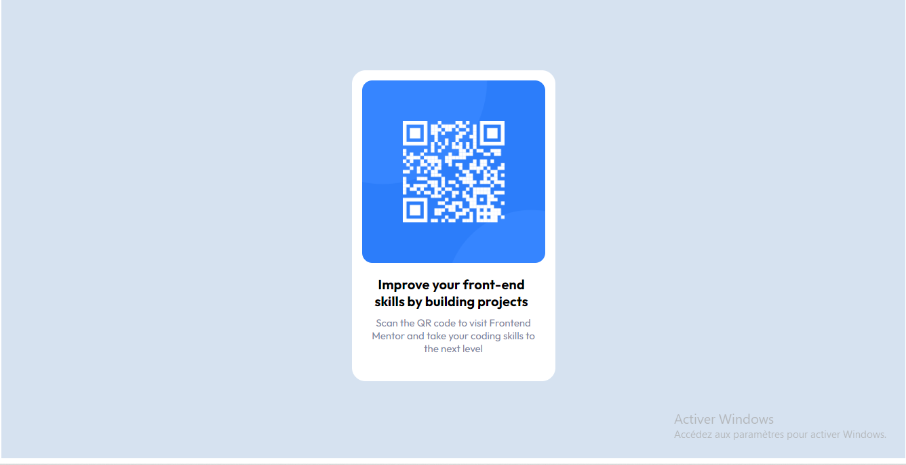

# Frontend Mentor - QR code component solution

This is a solution to the [QR code component challenge on Frontend Mentor](https://www.frontendmentor.io/challenges/qr-code-component-iux_sIO_H). Frontend Mentor challenges help you improve your coding skills by building realistic projects. 

## Table of contents

- [Overview](#overview)
  - [Screenshot](#screenshot)
- [My process](#my-process)
  - [Built with](#built-with)
 (#continued-development)
- [Author](#author)
- [Acknowledgments](#acknowledgments)

## Overview

### Screenshot

## My process

### Built with

- HTML5 
- CSS 3
- Flexbox

## Author

- Facebouk- [Armand Epa](https://www.facebook.com/profile.php?id=100084327851017)

## Acknowledgments

I would like to have more understanding about media queries and flex and grid displays

